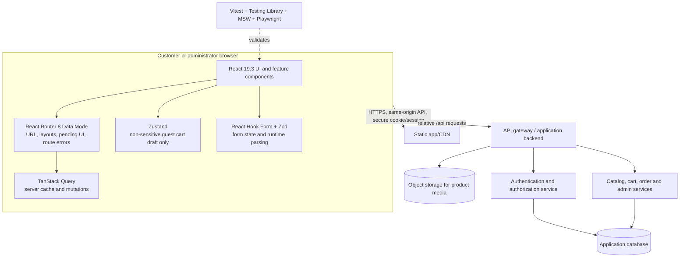

# Modern React Engineering — Course Guide

> **Current as of September 28, 2026.** This course is verified against the current official project documentation and stable package releases available on this date. It is delivered as 21 separate Markdown lessons rather than one giant tutorial. Start with [Module 1](modules/01-project-foundation.md), then work through the linked lessons below in order.

## 1. Course philosophy

This is a production-engineering course that happens to use React—not a tour of JSX syntax or a list of hooks to memorize. We will build one commerce product from a static catalog to a tested, secure, responsive storefront and admin application. Every major choice will be tied to a problem it solves, the boundary it belongs to, its trade-offs, and a way to verify it.

The recurring questions are:

1. **Who owns this data?** A component, a form, the URL, the server cache, or a shared client store?
2. **What causes this work?** A render, a user event, a route navigation, or synchronization with an external system?
3. **What is trusted?** Types help developers; runtime schemas and server-side validation protect application boundaries.
4. **How will we know it works?** Accessible behavior, tests, browser tools, logs, and measured performance—not assumptions.
5. **What must the server enforce?** Every authorization and business-rule decision that matters for security.

We prefer current official documentation and stable APIs. When an API has recently moved or an ecosystem tool has not caught up with the newest major release, the lesson names that constraint rather than pretending compatibility is universal. Re-check the stack before starting a new module; a package lockfile makes any individual project run reproducible.

## 2. Target skill level

The course is aimed at a learner with basic computer and browser literacy who wants to move from “I can make a React page” toward “I can join a frontend team and reason about a real application.” You do **not** need prior professional React experience. You should be willing to use a terminal, read errors, and build each feature yourself before comparing it with the reference implementation.

The JavaScript bridge in Module 1 covers the language skills the rest of the course relies on. If you already know them, use the checkpoints to move faster—but do not skip the architecture and debugging work.

## 3. Learning outcomes

By the end, you should be able to:

- Explain React's render/commit model, state snapshots, identity, reconciliation, and why rendering must be pure.
- Design component boundaries and APIs around composition and state ownership instead of turning every repeated line into an abstraction.
- Use hooks intentionally; distinguish derived values from synchronization effects; diagnose dependencies, stale closures, and re-render problems.
- Build a feature-based TypeScript application with a clear UI, routing, API, validation, and state boundary.
- Decide which values belong in local state, form state, URL state, server state, or global client state.
- Build reliable REST integrations with cancellation, typed boundaries, normalized errors, caching, mutations, and optimistic feedback.
- Implement authentication-aware UI and role-aware navigation without confusing either with backend security.
- Build accessible responsive forms, tables, menus, dialogs, loading/empty/error states, and motion.
- Test pure logic, user-visible component behavior, network behavior, and end-to-end workflows at the right layer.
- Measure before optimizing; ship only optimizations justified by profiling, network/bundle data, and user experience.
- Review, debug, document, and incrementally deliver a frontend feature using a team-friendly Git workflow.

## 4. Current as of September 2026 — verified stack

The exact package versions below were checked against official project release/documentation pages and the packages' stable npm `latest` tags on **2026-09-28**. “Docs” links lead to the API authority; “release” links show the release context. See [Verified stack and selection notes](verified-stack.md) for the rationale, compatibility notes, and version-source details.

| Area | Course version / selection | Primary official documentation |
|---|---|---|
| Runtime | Node.js **24.21.0 LTS**; npm supplied by the selected Node installation | [Node release status](https://nodejs.org/en/about/previous-releases) |
| UI runtime | `react` **19.3.0** + `react-dom` **19.3.0** | [React versions](https://react.dev/versions) · [React 19.3](https://react.dev/blog/2026/09/09/react-19-3) |
| Dev/build | Vite **8.3.1**, `@vitejs/plugin-react` **6.1.1** | [Vite guide](https://vite.dev/guide/) · [Vite 8 release](https://vite.dev/blog/announcing-vite8) |
| Language | TypeScript **6.0.3 course pin**; TypeScript **7.0.2 is the latest stable release**, but is not the course's initial typed-lint baseline | [TypeScript 7.0 announcement](https://devblogs.microsoft.com/typescript/announcing-typescript-7-0/) · [Handbook](https://www.typescriptlang.org/docs/handbook/intro.html) |
| Routing | React Router **8.4.0**, **Data Mode** for the Vite SPA | [Choose a mode](https://reactrouter.com/start/modes) · [Data Mode installation](https://reactrouter.com/start/data/installation) |
| Server state | TanStack Query **5.104.0** | [React Query docs](https://tanstack.com/query/latest/docs/framework/react/overview) |
| Shared client state | Zustand **5.0.15**; Redux Toolkit **2.12.0** is the comparison path, not a second global store | [Zustand](https://zustand.docs.pmnd.rs/) · [Redux Toolkit](https://redux-toolkit.js.org/) |
| Styling | Tailwind CSS **4.3.3** + `@tailwindcss/vite` **4.3.3**, with modern CSS and CSS Modules where useful | [Tailwind + Vite](https://tailwindcss.com/docs/installation/using-vite) · [Tailwind 4.3](https://tailwindcss.com/blog/tailwindcss-v4-3) |
| Component source/primitives | shadcn CLI **4.21.0** + Base UI **1.8.0** as the default primitive base | [shadcn Vite installation](https://ui.shadcn.com/docs/installation/vite) · [Base UI](https://base-ui.com/react) |
| Forms/runtime schemas | React Hook Form **7.89.0**, `@hookform/resolvers` **5.9.1**, Zod **4.6.5** | [RHF `useForm`](https://react-hook-form.com/docs/useform) · [Zod](https://zod.dev/) |
| Motion | Motion for React (`motion`) **13.4.4** | [Motion React docs](https://motion.dev/docs/react) · [Motion changelog](https://motion.dev/changelog) |
| Unit/component tests | Vitest **5.0.2**, React Testing Library **16.3.3**, `user-event` **14.6.7**, jsdom **30.1.0** | [Vitest](https://vitest.dev/guide/) · [RTL](https://testing-library.com/docs/react-testing-library/intro/) · [jsdom](https://www.npmjs.com/package/jsdom) |
| Browser end-to-end | Playwright **1.63.0** | [Playwright Test](https://playwright.dev/docs/intro) · [release notes](https://playwright.dev/docs/release-notes) |
| Network mocks | MSW **2.15.0** | [MSW docs](https://mswjs.io/docs/) |
| Lint/format | ESLint **10.11.0**, `typescript-eslint` **8.70.1**, Prettier **3.9.9** | [ESLint](https://eslint.org/docs/latest/) · [typescript-eslint](https://typescript-eslint.io/) · [Prettier](https://prettier.io/docs/) |
| React Compiler | `babel-plugin-react-compiler` **1.0.0**, introduced after fundamentals and only after measuring | [React Compiler](https://react.dev/learn/react-compiler) · [React Compiler 1.0](https://react.dev/blog/2025/10/07/react-compiler-1) |
| Component workshop | Storybook **10.6.0**, added when the shared component surface justifies it | [Storybook docs](https://storybook.js.org/docs) |
| Admin data tables | TanStack Table **9.2.4**, added only for the advanced admin grid | [Table v9 React docs](https://tanstack.com/table/latest/docs/framework/react/overview) |
| Very large lists | TanStack Virtual **3.14.13**, only if measurement shows DOM volume is a problem | [Virtual React docs](https://tanstack.com/virtual/latest/docs/framework/react/introduction) |
| Icons | Lucide React **1.48.0**, used sparingly and with accessible names | [Lucide React](https://lucide.dev/guide/packages/lucide-react) |

### The TypeScript version is an explicit integration decision

As of this verification date, TypeScript **7.0.2** is stable and is the latest TypeScript compiler. The official `typescript-eslint` supported-version page lists TypeScript `>=4.8.4 <6.1.0`; TypeScript 7.0 also does not ship a stable programmatic compiler API for tools that depend on it. Therefore the course's initial, reproducible **ESLint + typed-linting** combination uses **TypeScript 6.0.3**, the latest 6.x release found during verification. This is a tooling-compatibility pin, not a claim that TypeScript 6 is the newest TypeScript release. We will teach the TS 7 transition and upgrade only when the linter and related tools officially support it.

- [TypeScript's TypeScript 7.0 release notes](https://devblogs.microsoft.com/typescript/announcing-typescript-7-0/)
- [typescript-eslint supported dependency versions](https://typescript-eslint.io/users/dependency-versions/)
- [typescript-eslint release/versioning guidance](https://typescript-eslint.io/users/versioning/)

## 5. Why this technology path

- **React + Vite** gives us a fast, explicit client application and keeps React concepts visible. We will also discuss when a full-stack React Router framework or another SSR framework is a better product choice. Vite is a build tool, not the app's backend and not a React framework.
- **React Router Data Mode** is selected because the course needs nested layouts, route-level loading/action/pending/error behavior, and control over the Vite SPA and API architecture. TanStack Query remains the canonical server cache; a route loader can prefetch/ensure a Query cache entry rather than creating a competing data store.
- **TanStack Query** handles remote data lifecycle and cache coherence. It is not a replacement for local component state or Zustand.
- **Zustand** is reserved for genuinely shared client-only state. The capstone uses it for a non-sensitive anonymous cart draft before server sign-in/merge. Once authenticated, the server owns the cart and TanStack Query observes it. A dialog being open is not a reason to make a global store.
- **Tailwind v4 + shadcn/ui + Base UI** gives us a source-owned design system with accessible behavior primitives. New shadcn projects default to Base UI; Radix remains supported. We will inspect and own generated component code rather than treating it as a black box.
- **React Hook Form + Zod** separates high-frequency input/form state from application state and validates untrusted values at runtime. TypeScript alone cannot validate an HTTP response or a value typed in a browser form.
- **Motion** is for deliberate interaction and layout transitions, not decoration on every element. Native CSS is the simpler choice for simple hover/focus transitions.
- **Vitest + Testing Library + Playwright + MSW** cover different confidence layers. We test user-observable behavior and real request shapes instead of private React implementation details.
- **Storybook, TanStack Table, and TanStack Virtual** are introduced when the product has reusable components, admin data grids, or measured long-list costs. They are not mandatory dependencies on day one.

## 6. Complete course roadmap

The course is intentionally incremental. Each module has a build, a debugging task, exercises, official documentation, and a “what exists now / what is next” checkpoint. We will use the capstone all the way through; no Todo app is the primary project.

| Phase | Module(s) | Main learning | Capstone milestone / evidence |
|---|---|---|---|
| 1. Foundations | **1. Project, Git, JavaScript and TypeScript bridge** | Modules, destructuring, immutability, arrays, closures, promises, async/await, event loop, fetch/AbortController, TypeScript vs React, Vite and quality gates | Static, semantic product catalogue; reproducible install/build/lint workflow |
| 2. React mental model | **2. Rendering, components, JSX, props and state** | Render/commit, props, state snapshots, keys, events, lists, conditions, forms, controlled/uncontrolled input, composition | Interactive catalogue, local search, accessible filter controls |
|  | **3. Hooks and effects by purpose** | Why hooks exist; useState/useEffect/useRef/useMemo/useCallback/useContext/custom hooks; closures/dependencies; cleanup; effects only for external synchronization | Debounced search with a real timer/external subscription; remove effect-driven derived state |
|  | **4. React 19.3 and concurrent UI** | Actions, transitions, deferred rendering, Suspense/lazy, Activity, `useActionState`, `useOptimistic`, `useEffectEvent`, modern ref props, Fragment refs, ViewTransition, browser-only rendering, Compiler; error boundaries; RSC trade-offs | Optimistic cart quantity, non-blocking search, code-split route; capability limits documented |
| 3. Product structure | **5. Architecture and component engineering** | Feature/domain boundaries; small/medium/large structures; composition, compound/slot APIs, controlled components, prop design, over-abstraction | App shell, feature modules, component API and dependency direction reviewed |
|  | **6. Modern CSS, Tailwind v4 and responsive design** | CSS layout, grid/flex, tokens, breakpoints, focus/contrast; Tailwind v4 CSS-first config; CSS Modules/plain CSS/inline-style trade-offs | Responsive shell, dark/light tokens, mobile navigation |
|  | **7. shadcn/ui and accessible primitives** | Source generation, Base UI primitives, Radix comparison, dialogs, menus, popovers, tabs, tables, command palette, calendar, notifications, skeletons | Shared design-system components with keyboard and focus tests |
| 4. Navigation and state | **8. React Router v8 and URL design** | Data Mode, nested routes/layouts, params/search params, loaders/actions, lazy routes, pending/error boundaries, auth-aware layouts; URL vs local vs server state | Storefront, product detail, account and admin route map; filters are linkable |
|  | **9. State ownership, Zustand and Redux Toolkit** | Local/form/URL/server/global state; Context vs Zustand vs RTK; selectors, store boundaries, why not “one store for everything” | Guest cart store, guest-to-user merge, ownership map and tests |
| 5. Data and identity | **10. REST, API client and TanStack Query v5** | HTTP contract, typed client, query keys, freshness/GC, invalidation, mutations, optimistic UI, retries, cancellation, pagination, infinite/dependent/parallel queries, prefetching | Product catalogue and CRUD flows backed by Query and MSW |
|  | **11. Authentication, sessions and security** | Identity, authentication vs authorization, cookie/session/token models, login/logout/refresh, HttpOnly/Secure/SameSite, CSRF/CORS, expiry/bootstrap, 401 vs 403, MFA/reset/verification | Secure sign-in flow and protected user/admin navigation; server remains authority |
|  | **12. Authorization and RBAC** | User/Admin permissions, capability checks, least privilege, route UX vs backend enforcement, deny-by-default thinking | Admin product/user controls; permission matrix and 401/403 tests |
| 6. Product workflows | **13. Forms and runtime validation** | RHF registration/controller, Zod 4 schemas, parsing vs TS, field/server errors, arrays/nesting, async validation, pending/disabled states | Register, profile, product, checkout and admin user forms |
|  | **14. Admin tables and resilient UI states** | TanStack Table v9, server sort/filter/page, virtual scroll decision, reusable tables; loading/error/empty/success patterns | Responsive admin user/product grid; conflict, retry, empty, skeleton states |
|  | **15. Accessibility as an engineering constraint** | Semantic HTML, keyboard/focus, screen readers, labels, ARIA, dialog/menu patterns, WCAG/contrast, reduced motion | Keyboard-only and screen-reader review of core journeys; fix audited issues |
|  | **16. Motion and interaction polish** | Motion v13, enter/exit, layout, springs, gestures, AnimatePresence, View Transitions, reduced-motion preference, when not to animate | Subtle page/dialog/cart feedback with reduced-motion behavior |
| 7. Verification and shipping | **17. Testing strategy** | Vitest unit tests, RTL behavior/integration tests, MSW network mocks, Playwright browser journeys, fixtures, CI, flaky-test diagnosis | Login, validation, errors, permissions, CRUD, pagination and optimistic flow tests |
|  | **18. Storybook and component collaboration** | Storybook stories, variants, isolated providers/MSW, accessibility/interactions, documentation and visual review | Documented button/form/dialog/table states where isolation pays off |
|  | **19. Performance and React Compiler** | Profiler/browser tools, render costs, code splitting, caching, bundle/network/image performance, memoization only after measurement, compiler diagnostics, virtualization | Performance baseline and evidence-based optimization report |
|  | **20. Production quality, security and operations** | XSS/CSP/dependencies/secrets, safe environment configuration, error boundaries, retries, logs/observability, deployment/cache headers, Git/review/technical debt | Release checklist, threat model, smoke suite, rollback and monitoring plan |
| 8. Independent capstone | **21. Northstar delivery and architecture review** | Guided → partially independent → self-directed delivery; PRD, architecture proposal, trade-offs, PR review | Complete commerce/admin product; final challenge is a PRD only, with no implementation supplied |

**Every major UI feature is responsive** (mobile, tablet, desktop) and includes semantic markup, loading/error/empty/success states, and tests appropriate to its risk. Accessibility and security are woven through the course and revisited in dedicated reviews.

## 7. Capstone architecture

The product is **Northstar Commerce**, a commerce storefront and operations/admin platform. It has public catalog/search/product pages; login and account profile; favorites, cart and orders; settings and notifications; admin user/product management and analytics; responsive layouts; dark mode; forms; tables; dialogs; and optimistic interactions.



The CDN and API can be separate infrastructure components; the browser uses a same-origin `/api` path in the course setup. Vite proxies that path in development. Browser code never hard-codes `localhost` to reach another service. In production, the deployment/reverse proxy sends `/api` to the backend. The backend checks every permission and every price/order rule, regardless of which buttons the React app hides.

### State ownership contract

| State category | Example in Northstar | Owner | Why |
|---|---|---|---|
| Local UI | Whether a product quick-view dialog is open | The nearest owning React component | Short-lived and not meaningful outside that screen |
| Form | Dirty fields, validation errors, submit pending | React Hook Form + Zod | Field-level subscriptions and validation belong to the form |
| URL | Search term, category, sort, page | URL search parameters via React Router | Shareable, bookmarkable, navigable, survives reload |
| Server | Products, authenticated cart, user profile, orders, analytics | TanStack Query cache + backend as source of truth | Async, shared, stale, invalidated and permission-sensitive |
| Shared client | Anonymous cart draft before sign-in/merge | Small Zustand store | Cross-route client-only state; contains no credential, address, or payment secret |

The same domain can change owner across a lifecycle. For example, a guest cart is a temporary client draft; after sign-in, the backend owns the cart and the app reads it through TanStack Query. We do not persist an access token or refresh token in `localStorage`.

### Auth flow preview

The default capstone contract uses a server-managed, opaque, HttpOnly session cookie. A later lesson compares that with a short-lived in-memory access token plus an HttpOnly refresh cookie for cases where a direct SPA OAuth flow is needed. Neither model lets the browser make trusted authorization decisions.

```mermaid
sequenceDiagram
  actor User
  participant UI as React app
  participant API as API
  participant Identity as Auth/session service
  participant DB as Database
  User->>UI: Submit credentials over TLS
  UI->>API: POST /auth/login (credentials: include)
  API->>Identity: Verify account, password and account state
  Identity->>DB: Read account; create/rotate server session
  DB-->>Identity: Account/session result
  Identity-->>API: Session established
  API-->>UI: 200 user summary + Set-Cookie (HttpOnly, Secure, SameSite)
  UI->>API: GET /auth/me with cookie
  API->>Identity: Validate session and return current identity/roles
  Identity-->>UI: Current user; route UI can render
```

The full request, expiry/refresh, logout, CSRF, and RBAC diagrams are in the [backend contract](capstone/backend-contract.md) and the later authentication modules.

## 8. Dependency map

```text
JavaScript + browser + Git
        ↓
React render/state model → component composition → effects and modern React capabilities
        ↓                                  ↓
feature architecture ← CSS tokens + accessible primitives + responsive design
        ↓                                  ↓
React Router/URL state → API client → TanStack Query cache → forms/mutations/optimism
        ↓                     ↓              ↓
identity/session → RBAC UX → backend policy   MSW network contracts
        ↓                                     ↓
security/error model → tests (unit/component/E2E) → observability and release
        ↓
measurement → targeted optimization → Compiler/virtualization only when justified
```

No library replaces its neighboring responsibility: TypeScript is not runtime validation; Query is not local UI state; a router guard is not authorization; a component library does not remove accessibility review; a passing unit test does not replace a browser journey.

## 9. Recommended learning order

1. Read this course guide and the [verified-stack notes](verified-stack.md). Check the versions again before a new library module.
2. Complete [Module 1](modules/01-project-foundation.md) and create the project skeleton yourself.
3. For each module, write down your current design **before** reading the solution. Build the requested feature, then compare, test, and refactor.
4. Keep a small decision log: context, options, chosen boundary, trade-off, and what evidence would make you revisit it.
5. Use the official docs linked at the end of each module. Search the current API reference before pasting an old tutorial snippet.
6. Finish modules with the conceptual, coding, and architecture checkpoints. If one is unclear, reproduce the bug and explain it in your own words before moving on.
7. During the final challenge, use the [PRD](capstone/final-challenge-prd.md) to propose your own architecture first. The PRD deliberately contains **no implementation answer**. Ask for an architecture review before coding.

## 10. Expected prerequisites and tools

- A computer with a current browser, code editor, terminal, and internet access for official docs.
- Node.js 24 LTS for the verified baseline, npm, and Git. The exact supported runtime floor is also constrained by Vite 8 and React Router 8; see the official version notes in [the stack guide](verified-stack.md).
- Basic HTML familiarity is helpful. CSS basics are taught before styling-system choices.
- You should be comfortable creating folders, editing files, and running commands. If Git is new, Module 1 gives the small command set used throughout.
- No React, Redux, backend, or professional TypeScript experience is assumed.

## 11. Course files and lesson index

### Reference documents

- [Verified stack, trade-offs, and “older tutorial” warnings](verified-stack.md)
- [Official documentation map](official-documentation-map.md)
- [Northstar backend contract and auth/API diagrams](capstone/backend-contract.md)
- [Final independent capstone PRD (requirements only; no implementation answer)](capstone/final-challenge-prd.md)

### Twenty-one lessons

1. [Project foundation, JavaScript mental models, and TypeScript bridge](modules/01-project-foundation.md)
2. [React rendering, components, props, events, and state](modules/02-react-rendering-and-state.md)
3. [Hooks, Effects, refs, dependencies, and custom Hooks](modules/03-hooks-effects-and-custom-hooks.md)
4. [React 19.3 Actions, transitions, Suspense, and Compiler](modules/04-react-19-actions-and-concurrent-ui.md)
5. [Application architecture and component engineering](modules/05-application-architecture.md)
6. [CSS foundations, Tailwind v4, responsive design, and themes](modules/06-css-tailwind-responsive-design.md)
7. [shadcn/ui, Base UI, and accessible design-system primitives](modules/07-shadcn-base-ui-and-design-system.md)
8. [React Router 8 Data Mode and URL state](modules/08-react-router-and-url-state.md)
9. [State ownership, Zustand, and Redux Toolkit](modules/09-state-ownership-zustand-redux.md)
10. [REST contracts, API client, and TanStack Query v5](modules/10-rest-and-tanstack-query.md)
11. [Authentication, sessions, cookies, and client security](modules/11-authentication-sessions-and-security.md)
12. [Authorization, RBAC, and permission-aware UI](modules/12-authorization-rbac.md)
13. [Forms, React Hook Form, Zod, and server validation](modules/13-forms-and-runtime-validation.md)
14. [Admin tables, server pagination, and resilient UI states](modules/14-admin-tables-and-resilient-states.md)
15. [Accessibility as an engineering constraint](modules/15-accessibility-as-engineering.md)
16. [Motion, interaction feedback, and reduced motion](modules/16-motion-and-reduced-motion.md)
17. [Vitest, Testing Library, MSW, and Playwright](modules/17-testing-vitest-testing-library-msw-playwright.md)
18. [Storybook, component collaboration, and isolated states](modules/18-storybook-component-collaboration.md)
19. [Performance, profiling, and React Compiler](modules/19-performance-profiling-and-react-compiler.md)
20. [Production security, reliability, observability, and deployment](modules/20-production-security-operations-deployment.md)
21. [Independent capstone delivery and architecture review](modules/21-capstone-architecture-review-and-delivery.md)

The final challenge lives in its own PRD and contains requirements only. All lessons are separate files and follow a build → explain → debug → test → review progression.
