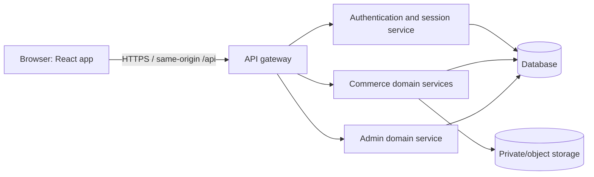
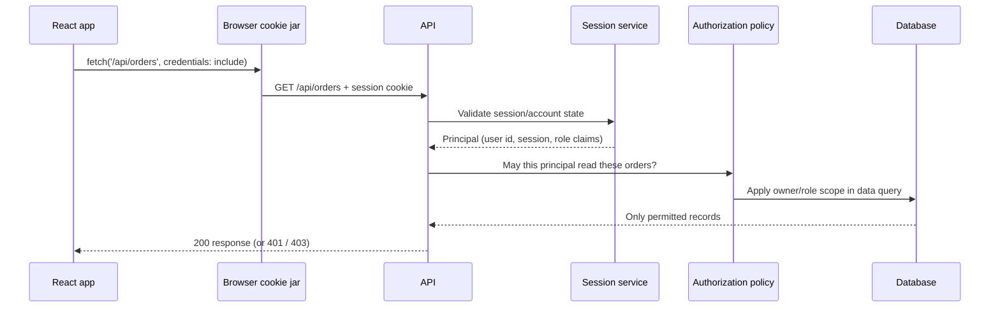
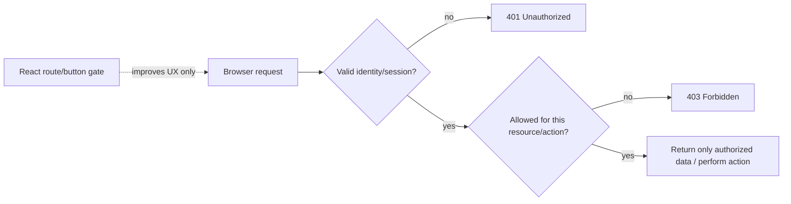

# Northstar Commerce — Backend Contract and Security Flows

This document is the frontend's working contract for the capstone. It lets us build the React application realistically before the backend exists, and it gives MSW handlers and API-focused tests one shared source of truth. The contract is an educational reference, not a claim that a browser is trusted or that a frontend can secure an API.

## 1. System boundary



The browser owns presentation and short-lived interaction state. The backend owns identity, permissions, stock, prices, order status, and durable application records. The server must re-check authorization and business rules for **every** request; a protected React route is only a user-experience boundary.

For the course, browser requests use relative paths such as `/api/products`. Vite's development server can proxy `/api` to a local backend; the production reverse proxy/CDN routes the same path. Browser code never calls a hard-coded `localhost` service.

## 2. Common HTTP conventions

- API prefix: `/api` for the course contract. Use HTTPS outside local development.
- JSON request/response media type: `application/json`; error media type may be `application/problem+json`.
- `Accept: application/json` on reads; send a `Content-Type` when sending JSON.
- For cookie-backed same-origin sessions, browser requests that require the cookie use `credentials: "include"`.
- Dates/times are ISO 8601 UTC strings. The client formats them for the user's locale; it does not guess a local time zone for stored instants.
- Money is an integer amount in currency minor units plus an explicit ISO currency code. The server is authoritative for totals, discounts, shipping, and tax.
- List requests support server-side filtering, sorting, and pagination. Empty search results are `200` with an empty `data` array, not a `404`.
- Error responses never include stack traces, database details, password/token values, or secrets.
- Mutating operations that may be retried (for example order placement) support idempotency keys.

### Error envelope

```json
{
  "type": "https://api.northstar.example/problems/validation",
  "title": "Some fields need attention",
  "status": 422,
  "code": "VALIDATION_FAILED",
  "requestId": "req_01J-example",
  "errors": [
    {
      "path": ["name"],
      "code": "too_small",
      "message": "Enter a product name."
    }
  ]
}
```

The backend's `code` is stable machine-readable context. The `message` is safe, user-facing guidance. The UI can localize/format known codes and should retain a safe fallback for unknown errors. Do not display arbitrary server debug text.

### Important status distinctions

| Status | Meaning in this contract | Typical UI response |
|---|---|---|
| `400 Bad Request` | Malformed request syntax or invalid query shape | Explain the invalid request or show a general recoverable error. |
| `401 Unauthorized` | No valid authenticated session/credential for a protected operation | Bootstrap or sign in; do not infer that the user lacks a role. |
| `403 Forbidden` | Authenticated identity is not allowed to perform this action, or account policy blocks it | Show an access-denied state; do not repeatedly refresh credentials. |
| `404 Not Found` | Resource does not exist or is intentionally not disclosed to this caller | Show a not-found state. |
| `409 Conflict` | Request conflicts with current server state, such as duplicate order submission or stock change | Reconcile with current server data; explain the conflict. |
| `412 Precondition Failed` | An `If-Match`/ETag version is stale | Ask the user to reload/review before overwriting concurrent edits. |
| `422 Unprocessable Content` | Well-formed request failed domain/form validation | Attach field errors and preserve safe user input. |
| `429 Too Many Requests` | Rate limit exceeded | Respect `Retry-After`; avoid aggressive retry loops. |
| `5xx` | Server-side failure | Show a useful error state, correlate `requestId`, and allow safe retry. |

The server may choose not to reveal whether a resource exists to an unauthorized user; a `404` can be preferable to leaking its existence. The policy is defined by the API/security team, not guessed by the component.

## 3. Endpoint catalogue

All roles listed below are enforced by the backend. “Frontend gate” describes navigation/rendering only and is never a security control.

### Authentication and identity

| Method and path | Purpose | Authorization / response |
|---|---|---|
| `POST /auth/register` | Begin account registration | Public; `202` generic verification message. Does not reveal whether an address is already registered. |
| `POST /auth/login` | Verify credentials and establish session | Public; `200` user summary + secure session cookie; invalid credentials return `401` with a generic message. |
| `POST /auth/refresh` | Refresh/rotate session or a token session where configured | Requires valid refresh/session cookie and CSRF checks; invalid/revoked state returns `401`. Details below. |
| `POST /auth/logout` | Revoke server session/refresh family and clear cookie | Idempotent; `204` after revocation/clear-cookie response. |
| `GET /auth/me` | Bootstrap current user/session/role information | `200` current identity or `401`; this is the frontend's source for current auth UI, not a permission grant. |
| `POST /auth/verify-email` | Verify a one-time email challenge | Public challenge exchange; response does not expose a reusable verification secret. |
| `POST /auth/password-reset` | Request a password reset message | Public; generic `202` to reduce account enumeration. |
| `POST /auth/password-reset/confirm` | Set a new password using one-time challenge | Public challenge exchange; server enforces expiry, reuse, and password policy. |

Example login request:

```http
POST /api/auth/login
Content-Type: application/json
Accept: application/json
X-CSRF-Token: <token-if-required-by-session-policy>

{
  "email": "customer@example.test",
  "password": "user-entered-password"
}
```

Example response body (never includes the password):

```json
{
  "user": {
    "id": "usr_01J8Q9",
    "displayName": "Avery Chen",
    "email": "customer@example.test",
    "role": "user",
    "accountStatus": "active"
  }
}
```

The response also sets an opaque server-managed cookie. A `403` may represent an account state such as a required email verification or suspended account; the response `code` should distinguish safe next steps without disclosing sensitive account details.

### Current user/profile

| Method and path | Purpose | Body/response |
|---|---|---|
| `GET /users/me` | Read current user's profile/preferences | `200` profile object. |
| `PATCH /users/me` | Update allowlisted profile/preferences fields | `200` updated profile; `422` field errors. Role, balance, and other privileged fields cannot be set through this endpoint. |

Example patch:

```json
{
  "displayName": "Avery C.",
  "preferences": {
    "marketingEmail": false,
    "theme": "system"
  }
}
```

The server validates the body independently. The TypeScript form type is not an authorization rule.

### Products/catalogue

| Method and path | Purpose | Authorization |
|---|---|---|
| `GET /products` | Public catalogue list; supports `q`, `category`, `sort`, `page`, `pageSize` | Public. |
| `GET /products/:productId` | Read public product detail | Public; `404` if missing/unavailable under the public policy. |
| `POST /products` | Create product | Admin only. |
| `PATCH /products/:productId` | Partial edit | Admin only; supports optimistic concurrency with ETag/`If-Match` where enabled. |
| `DELETE /products/:productId` | Archive/delete under retention policy | Admin only; irreversible or audited actions should be confirmed and logged. |

Example list request:

```http
GET /api/products?q=headphones&category=audio&sort=price.asc&page=1&pageSize=24
Accept: application/json
```

Example response:

```json
{
  "data": [
    {
      "id": "prod-1001",
      "name": "Orbit Studio Headphones",
      "description": "Clear, comfortable sound for focused work and long journeys.",
      "category": "audio",
      "price": { "amountMinor": 12900, "currency": "USD" },
      "stock": "in-stock",
      "image": {
        "url": "https://cdn.example.test/products/prod-1001.webp",
        "alt": "Black over-ear Orbit Studio Headphones"
      }
    }
  ],
  "meta": {
    "page": 1,
    "pageSize": 24,
    "total": 1,
    "hasNextPage": false
  }
}
```

`page` is one-based in this example. `pageSize` is capped by the API. Sort field/direction are allowlisted. A search string is data, never interpolated into a database query. For rapidly changing or very large datasets, a cursor contract can be preferable to offset pagination; the frontend must follow the backend's documented pagination model.

Example admin product creation:

```json
{
  "name": "Orbit Studio Headphones",
  "description": "Clear, comfortable sound.",
  "category": "audio",
  "price": { "amountMinor": 12900, "currency": "USD" },
  "stock": "in-stock"
}
```

The client does not set internal audit fields, computed stock availability, or permission fields. `POST` returns `201 Created` with a `Location` header and the created representation. `PATCH` accepts only editable fields; if the server uses ETags, the client sends `If-Match` and handles `412` rather than silently overwriting another admin's work.

### Guest/authenticated cart and favorites

| Method and path | Purpose | Authorization |
|---|---|---|
| `GET /cart` | Read the current server cart | Authenticated session. |
| `PUT /cart/items/:productId` | Set a product quantity (idempotent desired state) | Authenticated session; server validates product, quantity, price and stock. |
| `DELETE /cart/items/:productId` | Remove a line | Authenticated session. |
| `POST /cart/merge` | Merge a bounded guest draft after sign-in | Authenticated session; server revalidates every product/quantity and returns the canonical cart. |
| `GET /favorites` | Read favorites | Authenticated session. |
| `PUT /favorites/:productId` | Add/set favorite | Authenticated session. |
| `DELETE /favorites/:productId` | Remove favorite | Authenticated session. |

A guest cart can temporarily live in a browser client store as product IDs and quantities only. Do not store a payment method, address, session credential, or trusted price there. On login, the server revalidates and returns the authoritative cart. For authenticated customers, Query caches `GET /cart`; the server remains authoritative.

### Orders/checkout

| Method and path | Purpose | Authorization |
|---|---|---|
| `GET /orders` | List the current user's orders (or admin-scoped list) | User sees own orders; admin access is an explicit server policy. |
| `GET /orders/:orderId` | Read order detail | Owner or permitted admin, enforced on every request. |
| `POST /orders` | Submit checkout request | Authenticated session; `Idempotency-Key` required for safe retry. |

Example checkout request:

```http
POST /api/orders
Idempotency-Key: checkout_8b33...
Content-Type: application/json

{
  "cartVersion": "cart-v17",
  "shippingAddressId": "addr_01J8",
  "paymentMethodId": "pm_sandbox_4"
}
```

The browser does **not** send an authoritative total, role, discount amount, or stock count. The server reads canonical prices/stock, validates the cart and payment authorization, calculates tax/shipping, and creates an order. Payment details are tokenized with a payment provider; never collect or persist raw card numbers in this frontend capstone. A repeated idempotency key must not create duplicate orders.

### Admin users/analytics/notifications

| Method and path | Purpose | Authorization |
|---|---|---|
| `GET /admin/users?q=&role=&page=&pageSize=` | Search/filter/paginate accounts | Admin only. |
| `PATCH /admin/users/:userId/role` | Change user role through an explicit audited operation | Admin only; server policy may prohibit demoting the last admin. |
| `DELETE /admin/users/:userId` | Deactivate/delete account under retention policy | Admin only; audited and protected against self/last-admin policy violations. |
| `GET /admin/analytics?from=&to=` | Read permitted aggregate metrics | Admin only. |
| `GET /notifications` | Read current user's notifications | Authenticated user; own data only. |
| `PATCH /notifications/:notificationId` | Mark own notification read | Authenticated user; server enforces ownership. |

User role request:

```json
{ "role": "admin" }
```

Changing a role requires strong backend checks, audit logging, and normally additional safeguards. Hiding the “Make admin” action in React is not enough. A `403` response remains authoritative if a user crafts the request manually.

## 4. Authentication/session models

### Default capstone model: same-origin HttpOnly session cookie

- Login verifies credentials server-side and creates a random, opaque session reference stored/revocable server-side.
- The browser receives a cookie similar to:

```http
Set-Cookie: __Host-northstar-session=<opaque-value>; Path=/; Secure; HttpOnly; SameSite=Lax; Max-Age=1800
```

`__Host-` cookies require `Secure`, `Path=/`, and no `Domain` attribute. Use HTTPS in production. Set lifetime/idle expiry and rotation policy according to the threat model.
- JavaScript cannot read an `HttpOnly` cookie. The browser attaches it to same-origin requests with `credentials: "include"`.
- The app bootstraps identity from `GET /auth/me`; the cookie value itself is never copied into Zustand, React state, localStorage, or logs.
- Logout revokes the server session and sends an expired cookie. Clearing visible React state alone is not logout.
- Since browsers attach cookies automatically, protect state-changing operations against CSRF. Use a deliberate `SameSite` policy, validate `Origin`/`Referer` as appropriate, and use a CSRF-token pattern where the deployment/threat model requires it. SameSite is defense-in-depth, not a universal substitute for CSRF design.

### Direct SPA token variant: short access token + HttpOnly refresh cookie

Some OAuth/API deployments return a short-lived access token to the SPA and use a refresh credential held in an HttpOnly cookie. In that design:

- Keep the access token in memory only (not localStorage/sessionStorage); JavaScript can still read it, so XSS remains serious.
- Keep the refresh credential HttpOnly, Secure, and appropriately SameSite; rotate it on refresh, bind rotation to a server-side token family/session, and detect replay/reuse.
- Protect refresh/logout against CSRF because the refresh cookie is ambient browser authority.
- On token expiry, refresh once, coordinate concurrent 401 requests so they do not race, retry the original idempotent request at most once, then require sign-in if refresh fails. Do not create infinite refresh loops.
- Prefer a Backend-for-Frontend or cookie session where it is a good fit and avoids exposing bearer tokens to browser JavaScript.

The course capstone uses the session-cookie model; the access-token diagrams below explain the alternative explicitly rather than pretending a cookie session has a browser-visible access token.

## 5. Sequence diagrams

### Login (default session model)

```mermaid
sequenceDiagram
  actor User
  participant Browser as Browser
  participant React as React app
  participant API as API
  participant Auth as Authentication service
  participant DB as Database
  User->>React: Enter email/password and submit
  React->>API: POST /auth/login (TLS, credentials include)
  API->>Auth: Verify password, account status, rate limit
  Auth->>DB: Read account; create session record
  DB-->>Auth: Account + session id
  Auth-->>API: Valid identity/session
  API-->>Browser: 200 user summary + Set-Cookie(HttpOnly, Secure, SameSite)
  Browser-->>React: Response; cookie is not exposed to JS
  React->>API: GET /auth/me (cookie attached)
  API->>Auth: Validate session and expiry
  Auth-->>React: Current user/role/account state
  React-->>User: Render permitted user experience
```

### Request and authorization



### Access-token expiration and refresh (direct SPA variant only)

```mermaid
sequenceDiagram
  participant React as React app (memory token)
  participant API as Resource API
  participant Browser as Browser cookie jar
  participant Auth as Auth/refresh service
  participant DB as Session/token store
  React->>API: GET /api/orders + expired short-lived access token
  API-->>React: 401 ACCESS_TOKEN_EXPIRED
  React->>Browser: Request POST /auth/refresh with credentials include
  Browser->>Auth: HttpOnly refresh cookie + CSRF/Origin checks
  Auth->>DB: Validate, rotate refresh family, check revocation/reuse
  DB-->>Auth: New session/refresh state
  Auth-->>Browser: 200 short-lived access token + Set-Cookie(rotated refresh)
  Browser-->>React: Access token body; refresh value remains unreadable
  React->>API: Retry original request once with new in-memory token
  API-->>React: 200 response (or final error)
```

If refresh returns 401/403, clear in-memory auth state and sensitive cached data, then return to sign-in. Do not retry indefinitely, and do not retry non-idempotent work without an idempotency contract.

### Logout

```mermaid
sequenceDiagram
  actor User
  participant React as React app
  participant Browser as Browser cookie jar
  participant API as API
  participant Auth as Session/refresh service
  participant DB as Database
  User->>React: Choose Sign out
  React->>Browser: POST /auth/logout (credentials include, CSRF protection)
  Browser->>API: Send session/refresh cookie
  API->>Auth: Revoke active session/token family
  Auth->>DB: Mark revoked; record audit event as appropriate
  DB-->>Auth: Revocation committed
  API-->>Browser: 204 + Set-Cookie expired
  Browser-->>React: Cookie removed by browser
  React->>React: Clear auth/query cache and navigate to public page
```

### RBAC mental model



A `401` is an authentication/session problem. A `403` means the caller is authenticated but not permitted (or is blocked by policy). The backend enforces both. Frontend role checks reduce confusing navigation; they do **not** protect the endpoint.

## 6. Environment and network rules

- Use relative browser paths (`/api/...`) by default. The frontend should not need a hard-coded environment-specific host for the API.
- Vite `VITE_*` values are public build-time configuration. Do not put database passwords, signing secrets, private keys, payment secrets, or confidential credentials in them.
- If the API is cross-origin, configure CORS with an exact allowed origin and the required credentials/header policy. Credentialed CORS cannot use `Access-Control-Allow-Origin: *`. CORS controls which browser origins may read responses; it is **not** API authentication or authorization.
- Set explicit cookie flags and an appropriate domain/path policy. Never assume a cookie is secure because it is HttpOnly; HttpOnly blocks JavaScript reads, not CSRF or malicious same-origin actions.
- Apply runtime validation on both client and server for usability and security. The server remains authoritative.
- Use rate limiting, session revocation, audit logs, and monitoring on the backend/infrastructure. Do not expose secrets or raw auth material in logs, telemetry, query keys, analytics, or error messages.

## 7. Mocking and contract evolution

MSW handlers model the HTTP contract, not component internals. Keep a small set of deterministic fixtures for customer, admin, empty catalogue, invalid form response, expired session, network failure, and conflict cases. Browser development and Node tests should reuse the same request handlers where practical.

When a backend contract changes:

1. Update the request/response schema and example here.
2. Update the shared runtime schema and API client type.
3. Update MSW handlers and fixtures.
4. Update UI tests for success and failure paths.
5. Check a real/staging contract or generated API schema when available.

## Official documentation

- [React security: Trusted Types announcement](https://react.dev/blog/2026/09/09/react-19-3)
- [Vite environment variables](https://vite.dev/guide/env-and-mode)
- [Fetch API](https://developer.mozilla.org/en-US/docs/Web/API/Fetch_API)
- [CORS](https://developer.mozilla.org/en-US/docs/Web/HTTP/CORS)
- [Cookies](https://developer.mozilla.org/en-US/docs/Web/HTTP/Cookies)
- [OWASP CSRF Prevention Cheat Sheet](https://cheatsheetseries.owasp.org/cheatsheets/Cross-Site_Request_Forgery_Prevention_Cheat_Sheet.html)
- [OWASP Session Management Cheat Sheet](https://cheatsheetseries.owasp.org/cheatsheets/Session_Management_Cheat_Sheet.html)
- [OWASP Authentication Cheat Sheet](https://cheatsheetseries.owasp.org/cheatsheets/Authentication_Cheat_Sheet.html)
- [MSW documentation](https://mswjs.io/docs/)
